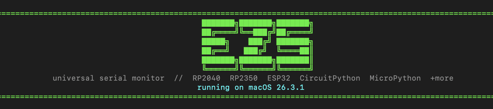

# ezserial / ezs!



## What is ezs?!

ezs (ezserial) is a simple program that runs natively in your terminal and functions as a serial monitor for ANY MCU board, on ANY flavor of Linux AND macOS!

No more listing `/dev/tty` ports or figuring out which `usbmodem` your AliExpress USB-C cable is connected to!

If you'd rather watch a video demo than read this whole boring blob, [here ya go](https://youtu.be/DUAF1HSYH8M)!!

ezs automatically detects which serial port your MCU is connected to, automatically detects which type of MCU it is, and automatically color-codes serial lines!

Additionally, ezs supports outputting full session logs to txt files, and has soo many more hidden features! you can list all port devices with `ezs --list`, and listen to a specific baud or port with `ezs --baud [baud]` and `ezs --port [port]`, respectively!!

ezs is fully open-source, 100% free, and so simple that even your grandmother could probably figure out how to use it.

## Requirements

- **Git**
- **Python 3.8+ & Pip**

## Installation

**macOS / Linux:**

Step 1: Open your terminal and clone this repository locally:

```bash
git clone https://github.com/newtontriumphant/ezserial
```

Step 2: In your terminal, change to the folder you just cloned:

```bash
cd ezserial
```

Step 3: Run the install script:

```bash
sudo chmod +x install.sh && ./install.sh
```

After that, you're done! You can go on to Usage!

## Usage

After you've followed the above steps, ezs should be ready for use. (Yay!) Here's how to use it:

Open up your Terminal again and just type `ezs` (or `ezserial` if you're a lengthy typa person).

If you have a MCU already plugged in sending serial messages, ezs will auto-detect it. If you don't, go and plug one in! ezs should find it the instant you plug it in.

If it doesn't, try fully quitting and reopening your terminal. If that fails, re-run the install script and restart your OS. If nothing else works, feel free to contact @zsharpminor on the Hack Club Slack or ask your LLM of choice!

For a full list of commands that ezs supports, run `ezs -h` after you complete the install!

Made with ♡ by zsharpminor